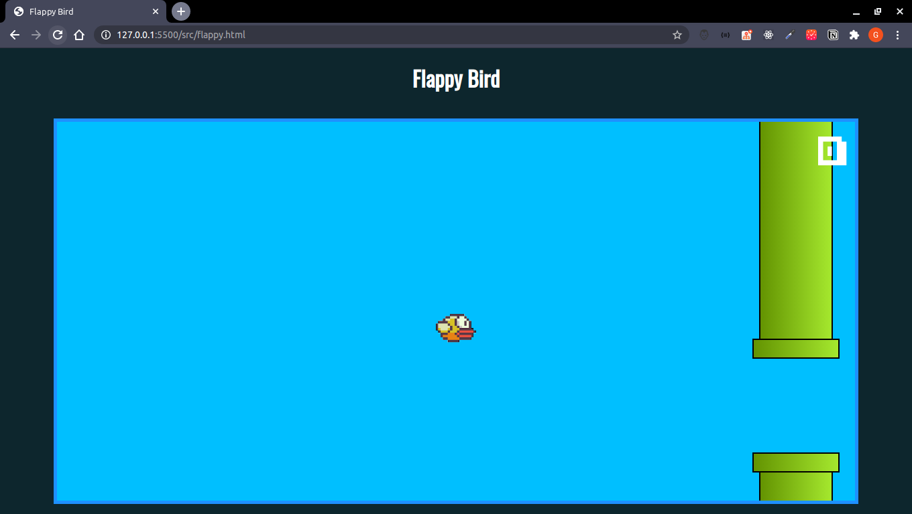

# FlappyBird-JS

<h3>Flappy Bird clone game</h3>

<h3>Technologies</h3>

Javascript(ES)  
HTML5  
CSS3  

<h3>How to use</h3>

1- Clone this repository  
2- Go into the repository  
3- Open src/flappy.html  
4- Tap space for the bird fly  
